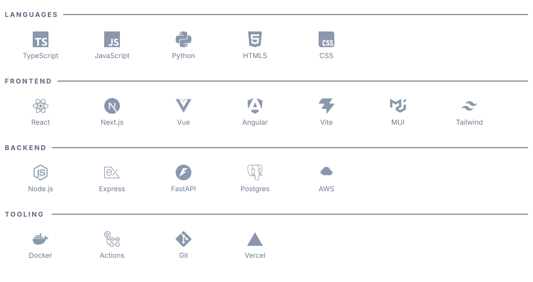

<picture>
  <source media="(prefers-color-scheme: dark)" srcset="assets/banner-dark.svg">
  <source media="(prefers-color-scheme: light)" srcset="assets/banner-light.svg">
  
</picture>

  

    

**Full stack engineer · 7+ years · React, TypeScript, Python, AWS · Based in India**

 

## At a glance

- **Seven years shipping production software**, most of it in US healthcare, where downtime and slow screens cost real operational hours.
- **Currently at Miratech**, building real-time contact center tooling for a Fortune 5 healthcare client. React and TypeScript on the front, Python on AWS Lambda behind it.
- **Own features end to end**: UI, API, infrastructure, and observability.
- **Track record on the hard, unglamorous work**: claims platforms, EDI automation, and framework migrations delivered without stopping the business.

 

## What I bring to a team

| | |
|---|---|
| **Real-time frontends** | Interfaces that operations teams keep open all day, where every second of latency gets noticed. State, performance, and resilience treated as features. |
| **Serverless backends** | Python services on AWS Lambda, provisioned with Terraform, designed to be cheap to run and simple to reason about. |
| **Legacy modernisation** | Framework migrations done incrementally, so the product keeps shipping while the foundation changes. |
| **Observability** | I unified frontend and backend Splunk logging so one query traces a whole user journey. Incidents get shorter when the trail is already there. |
| **Developer experience** | Build times, hot reload, and deploy speed compound over a team's whole year. I fix them early. |

 

## Stack

<picture>
  <source media="(prefers-color-scheme: dark)" srcset="assets/stack-dark.svg">
  <source media="(prefers-color-scheme: light)" srcset="assets/stack-light.svg">
  
</picture>

 

## Selected work

**Shri Secure** · multi-tenant compliance platform 
Author compliance frameworks once, collect answers and evidence from every client organisation, and review through to sign-off. Access is invite-only.

**Inverter Guru** · power backup sizing calculator 
Tell it what you want to run during a power cut and it returns the inverter VA, battery Ah, battery count, and the 12V, 24V or 48V setup, in plain words. Domain maths hidden behind a simple interface.

**100 Days of CSS** · learning platform 
One hundred small, self-contained CSS builds, plus an interview questionnaire, a timed quiz, and a tagged reading list.

More detail and live demos on the [portfolio](https://rahulhome.vercel.app). I also write about React state management, error boundaries, and context performance on [Medium](https://medium.com/@i.e.rahul).

 

## How I work

**Internal tools that people open twice.** Adoption is the only real test of an internal tool.

**Debuggability first.** If a problem cannot be traced in one query, the system is not finished.

**Boring, readable code.** The next person to open the file matters more than the cleverness of the diff.

**Clear written communication.** Decisions, trade-offs, and handovers on the page, so nobody needs a meeting to understand the code.

 

## Let's talk

Open to full-time roles, freelance engagements, and mentoring. The fastest way to reach me is [email](mailto:ierahul20@gmail.com), and the [résumé](https://rahulhome.vercel.app/Rahul_Mourya_CV.pdf) has the full history.

Off keyboard I am usually exploring somewhere new, hunting down food spots, or [making digital art](https://www.instagram.com/archive.sketch/).
