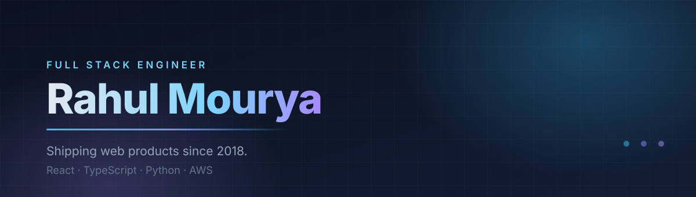

<picture>
  <source media="(prefers-color-scheme: dark)" srcset="assets/banner-dark.svg">
  <source media="(prefers-color-scheme: light)" srcset="assets/banner-light.svg">
  
</picture>

 

    

 

> **Currently** building real-time contact center tooling for a Fortune 5 US healthcare client.
> Before that, four years deep in US healthcare platforms.

 

## 🧰 &nbsp;Stack

<table align="center">
<tr>
<td align="center" width="180"><b>Languages</b></td>
<td align="center"></td>
</tr>
<tr>
<td align="center"><b>Frontend</b></td>
<td align="center"></td>
</tr>
<tr>
<td align="center"><b>Backend</b></td>
<td align="center"></td>
</tr>
<tr>
<td align="center"><b>Cloud &amp; Tooling</b></td>
<td align="center"></td>
</tr>
</table>

On AWS, mostly Lambda, DynamoDB, S3 and API Gateway.

 

## ⚙️ &nbsp;How I work

<table>
<tr><td width="60" align="center">🔁</td><td><b>Internal tools that people open twice.</b> Adoption is the only real test.</td></tr>
<tr><td align="center">⚡</td><td><b>Fast feedback loops.</b> Build times, hot reload, deploy speed.</td></tr>
<tr><td align="center">🔍</td><td><b>Debuggability first.</b> I once unified frontend and backend Splunk queries so one query traces a whole user journey. Never went back.</td></tr>
<tr><td align="center">📖</td><td><b>Boring, readable code</b> over clever code. The next person to open this file matters.</td></tr>
</table>

 

## 🤝 &nbsp;Beyond the day job

I take on freelance projects, contribute to open source when something interesting comes along, and enjoy mentoring. If any of that sounds useful, [get in touch](mailto:ierahul20@gmail.com).

Off keyboard: exploring new places, hunting down food spots, liking cat pictures, and [making digital art](https://www.instagram.com/archive.sketch/).

 

⚡ Fun fact: I love cats 🐈

